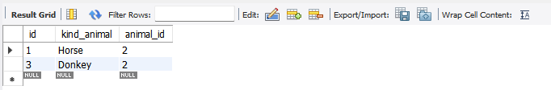
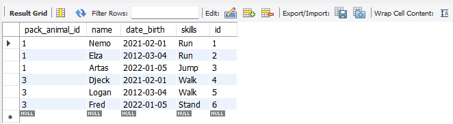
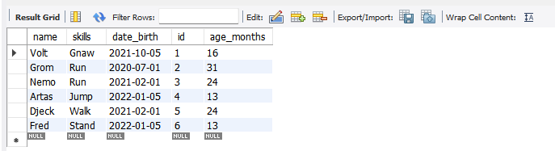

___
**10.** 
- Удалив из таблицы верблюдов, т.к. верблюдов решили перевезти в другой питомник на зимовку. 
- Объединить таблицы лошади, и ослы в одну таблицу.
___
- ***Таблица без верблюдов***

- ***Объединение таблиц***

___
___

**11.** 
- Создать новую таблицу ***“молодые животные”***, в которую попадут все животные старше ***1 года***, но младше ***3 лет*** и в отдельном столбце с точностью до месяца подсчитать возраст животных в новой таблице.
___

- ***Возрастная таблица от 1 года до 3***

___
___