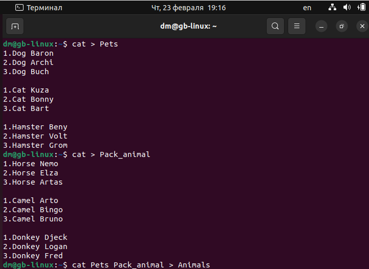
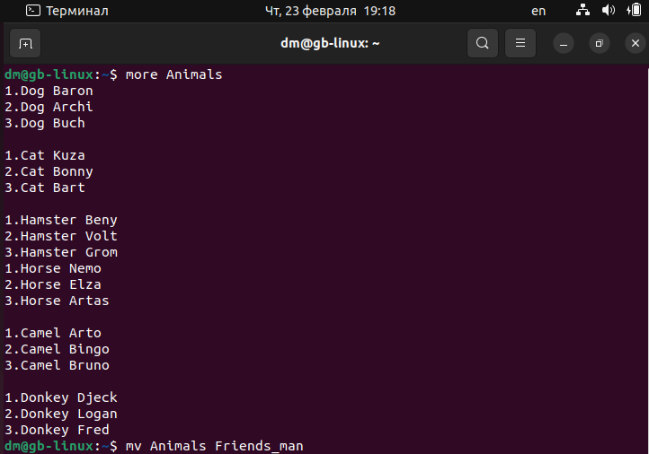
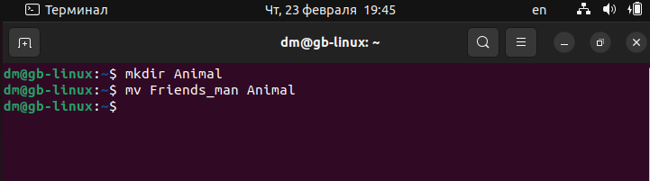
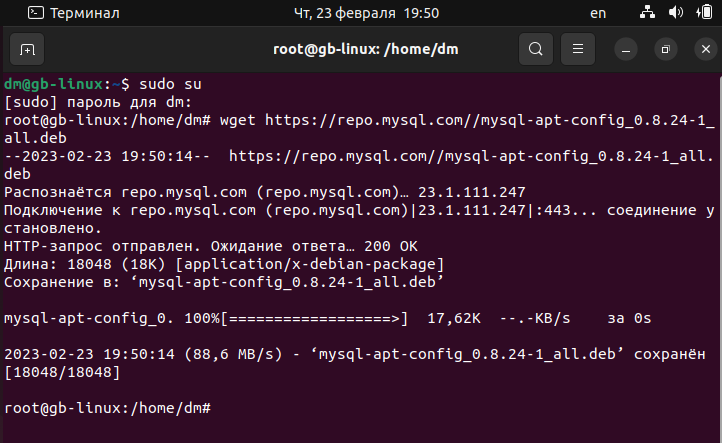
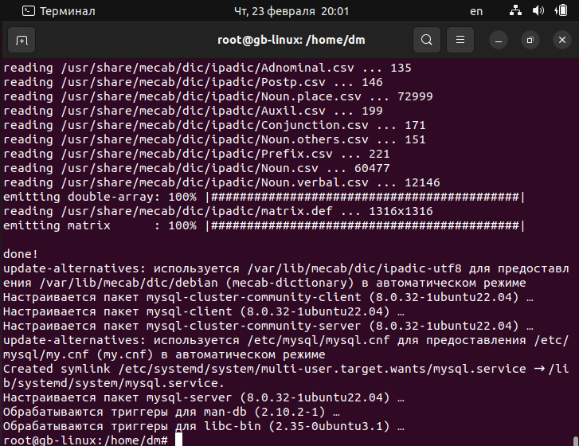
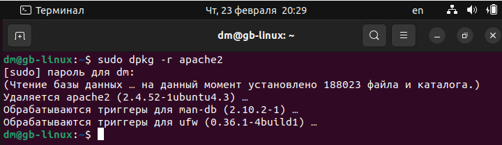

_____
**1.** 
- Используя команду ***cat*** в терминале операционной системы ***Linux***, создать
два файла ***Домашние животные*** ( заполнив файл *собаками*, *кошками*,
*хомяками* ) и ***Вьючные животными*** заполнив файл *лошадьми*, *верблюдами* и
*ослы*), а затем объединить их. 
- Просмотреть содержимое созданного файла.
- Переименовать файл, дав ему новое имя ( ***Друзья человека*** ).

```
dm@gb-linux:~$ cat > Pets
1.Dog Baron
2.Dog Archi
3.Dog Buch

1.Cat Kuza
2.Cat Bonny
3.Cat Bart

1.Hamster Beny
2.Hamster Volt
3.Hamster Grom
dm@gb-linux:~$ cat > Pack_animal
1.Horse Nemo
2.Horse Elza
3.Horse Artas

1.Camel Arto
2.Camel Bingo
3.Camel bruno

1.Donkey Djeck
2.Donkey Logan
3.Donkey Fred

dm@gb-linux:~$ cat Pets Pack_animal > Animals
dm@gb-linux:~$ more Animals
dm@gb-linux:~$ mv Animals Friends_man
```


____
**2.** 
- Создать директорию, переместить файл туда.
```
dm@gb-linux:~$ mkdir Animal
dm@gb-linux:~$ mv Friends_man Animal
```

____
**3.** 
- Подключить дополнительный репозиторий ***MySQL***. 
- Установить любой пакет из этого репозитория.

```
dm@gb-linux:~$ sudo su
root@gb-linux:/home/dm# wget https://repo.mysql.com//mysql-apt-config_0.8.24-1_all.deb
root@gb-linux:/home/dm# dpkg -i mysql-apt-config_0.8.24-1_all.deb
root@gb-linux:/home/dm# apt update
root@gb-linux:/home/dm# apt install mysql-server
```


____
**4.** 
- Установить и удалить ***deb-пакет*** с помощью ***dpkg***.
```
dm@gb-linux:~$ cd
dm@gb-linux:~$ apt download apache2
dm@gb-linux:~$ sudo dpkg -i apache2_2.4.52-1ubuntu4.3_amd64.deb
dm@gb-linux:~$ sudo dpkg -r apache2
```

____

**5.** 
- Выложить историю команд в терминале ***ubuntu***.
____


