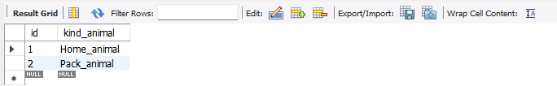
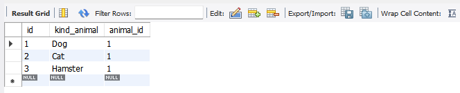
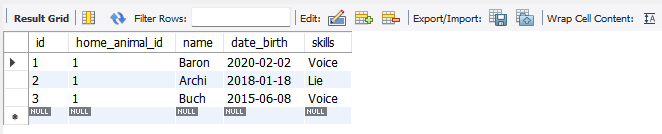
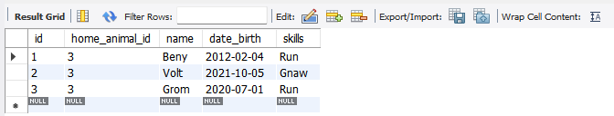
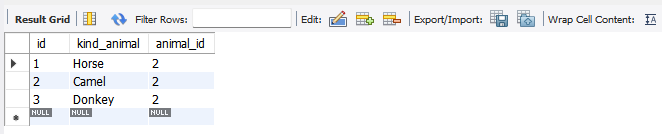
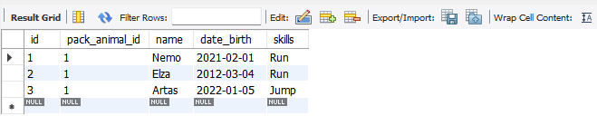
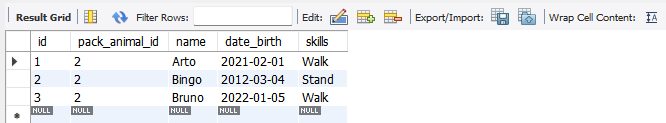
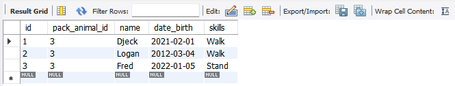

___
**9.** 
- Заполнить низкоуровневые таблицы именами(животных), командами, которые они выполняют и датами рождения.
___

- ***Таблица родитель(класс животные)***

___
___
- ***Таблица домашних животных***

___

- ***Таблица для собак***

- ***Таблица для кошек***

- ***Таблица для хомяков***

___
___

- ***Таблица вьючих животных***

___
- ***Таблица для лошадей***

- ***Таблица для верблюдов***

- ***Таблица для ослов***

____
___
